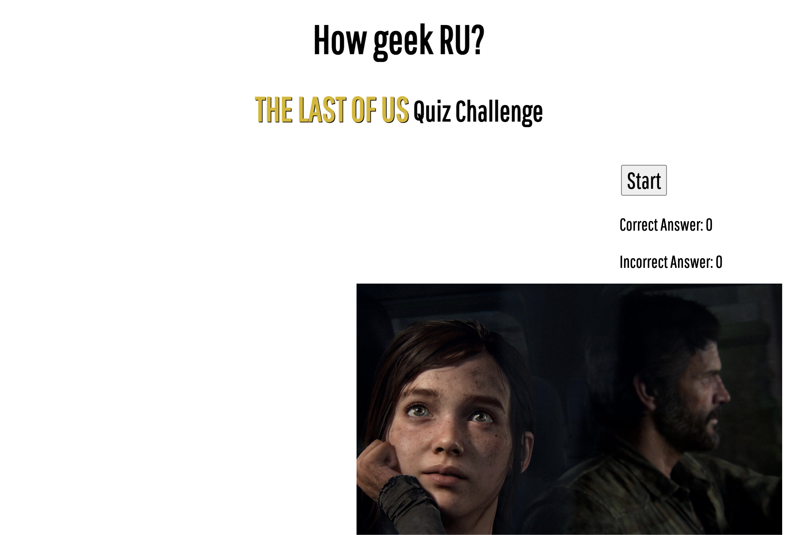
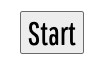
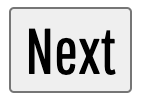
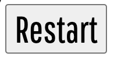
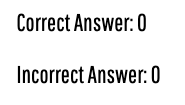
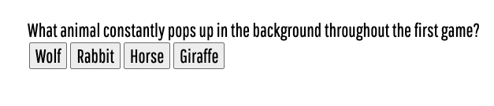
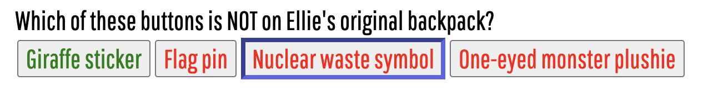

# The Last of Us Quiz Challenge

The Last of Us Quiz Challenge is a small quiz website designed for those gamers who love the game The Last of Us Part 1 and Part 2. There are total 5 questions with 4 answer options. 

## Features

### Existing Features

- __Main Front Page__

  - There is only one page for this quiz website. The main front page is what the user will first see once directed to the website. 
  - There is the *title* on the top center of the page, a *start button* to commence quiz, *scoreboard* and a *default image* of the game's protagonist Ellie and Joel to greet the user.

  

- __Start Button__

  - Start button is for starting the quiz. 
  - Start button will be hidden once the user clicks it, and will trigger the question and the answer options to show up. 

  

- __Next Button__

  - Next button is hidden by default but will show up once the user selects the answer.
  - Next button is also designed to be hidden when the user clicks the Next button. 

  

- __Restart Button__

  - Restart button will only show once the user finishes the last question. 
  - By clicking Restart button, the user can replay the game. 
  - Restart functions the same as the Start button.

  

- __Score Board__

  - Score board is for showing how many question the user got correct or wrong. 
  - Each *Correct Answer* and *Incorrect Answer* is set to 0 by default and it will be incremented by 1 when the user gets either the correct answer or the incorrect answer.
  
  

- __Question Area__

  - Once clicking start button from the initial page, the question area that contains the question and the answer options will show up.
  - When the user chooses an answer, the blue boarder will be drawn on the selected answer button to indicate the users selection. 
  - Also the answer text colour will change according to the correct answer being true (green) or false (red). 

  
  

- __Answer Explanation and Image__

  - Once the user choose an answer, the explanation for the correct answer will show up underneath the question area. 
  - Also a supporting image from the game play screenshot will be displayed to give detailed understanding of the answer.

  

## Testing 

### Validator Testing 

#### __HTML__
  - Two issues were found during the check over [W3C Validator check](https://validator.w3.org/#validate_by_input)

    - Error: Element img is missing required attribute src.
    From line 34, column 13; to line 34, column 50

          ↩     

      > Changed img to div and solved the issue. 

    - Error: An img element must have an alt attribute, except under certain conditions. For details, consult guidance on providing text alternatives for images.

      From line 34, column 13; to line 34, column 50

          ↩     
      > Same issue as above. Changed img to div and solved the issue. 

#### __CSS__
  - No errors or bugs were found when passing through the official [W3C Validator check](https://validator.w3.org/#validate_by_input)

### Lighthouse 

### Unfixed Bugs
  - There is no unfixed bugs. 

### How It Works on Different Screen Size Device
  - This website is desiged to adapt on different screen size devices. 
  - **The background image** adapts to different screen sizes and maintains the same resolution to function as a background without being overlapped or cropped. 
    
    

  - **Why Join Beatfit** have a different background color sizing applied so that the paragraph does not overlap the background. Two sections will then show vertically (right-inline will drop down) placed once the screen width is less than 700px.

    

  - **Timetable** also drops down as lining vertically once the screen width is less than 900px.

    

  - **Join Form** will be adjusted to move to the left once the screen width is smaller than 800px. 

     

## Deployment

- The site was deployed to GitHub pages. The steps to deploy are as follows: 
  - In the GitHub repository, navigate to the Settings tab.
  - From the Code and automation menu, select the Pages.
  - From the Build and deployment section, selected the branch to have Main and /root, then hit save. 
  - Once the saved, the page will be automatically be refreshed and on top of the Github Pages section, the deployed page could be found after 'Your site is live at.'

The live link can be found here - https://choyoon88.github.io/louquiz/

## Local Deployment

- Local deployment could be done following the steps. 
  1. From my Gitpod BeatFit repository, click '<>Code' right next to green 'Gitpod' icon. 
  2. Select 'local' and HTTPS.
  3. Copy the HTTPS address: https://github.com/choyoon88/beatfit.git
  4. Open terminal on the Mac computer.
  5. Type **_git clone_** and paste the HTTPS address. 
  6. Install the git developer tools and download the command line in your computer. 

## Credits 

### Support

Useful links for validation and help:

- https://codeinstitute.net/ JavaScript main study done by Code Institute. 
- https://www.youtube.com/watch?v=riDzcEQbX6k
Basic JavaScript Structure for building the question functions.
- https://www.w3schools.com/
Searched for assistance and tips.
- https://twinfinite.net/2022/08/the-hardest-the-last-of-us-trivia-quiz-youll-ever-take/
Taken game questions.
- https://chat.openai.com/
Chat GPT was most helpful when asking questions of the function of my codes. Also I got assistance of how to create additional functions. (e.g. How to prevent the user from adding more than 1 to the score when clicking the answer multiple times, How to reset increment scores when clicking restart etc.)

### Content 

- The icons in the footer were taken from [Font Awesome](https://fontawesome.com/)

